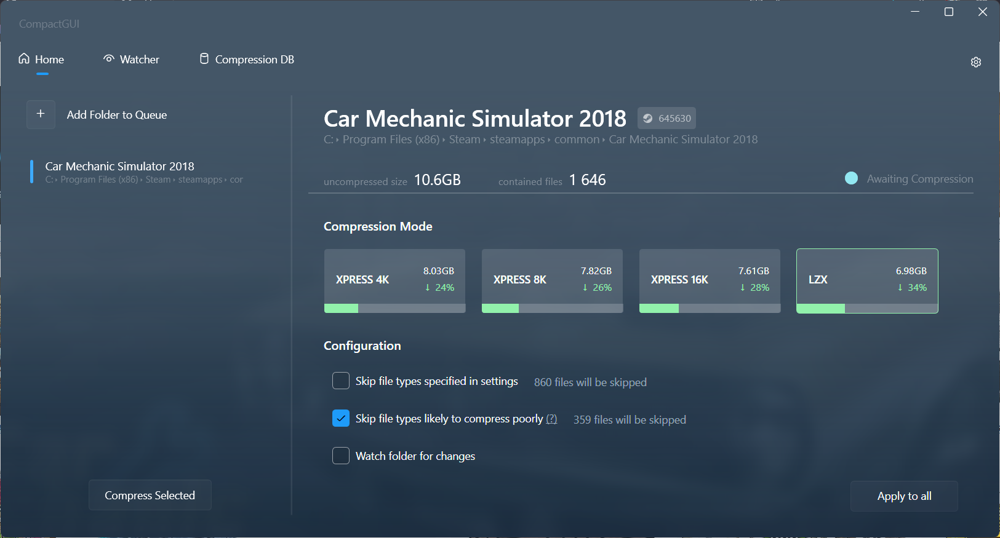
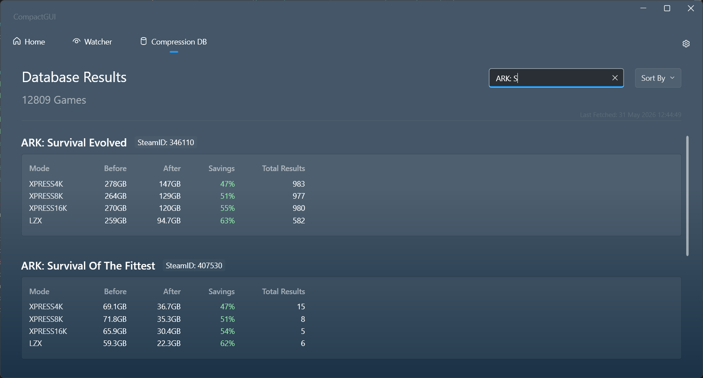
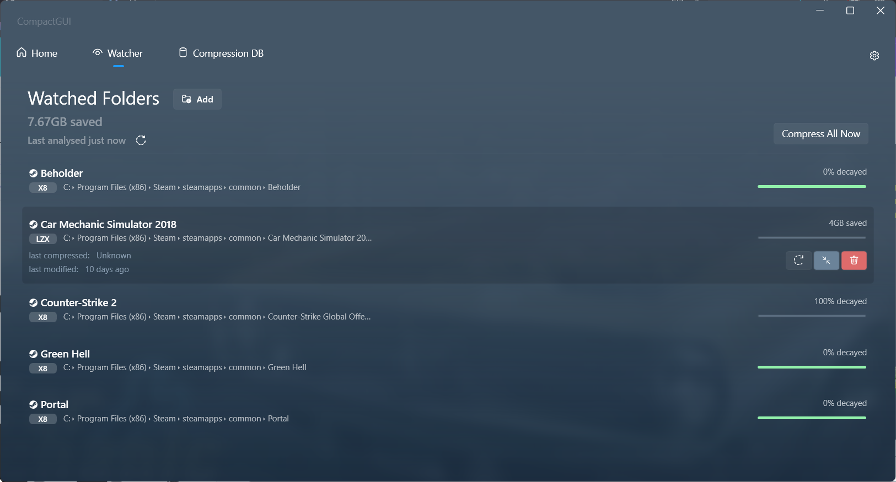

<!--more-->
## Problem it can also solve
- How to make ARK: Survival Evolved take up less space?

## Prerequisite
- OS: Windows 10 and above
- Can only be used on game without ***DirectStorage API***
- Internet connection ???

## What does it do?
It reduce file sizes of game with negligible performance impact using a Windows 10 feature (compact.exe).

### Example:
- ARK: Survival Evolved
259GB > 94.7GB (Size reduced by **63%**)

## Installation

### Method 1: Direct Download
1. Navigate to its [GitHub Repository](https://github.com/IridiumIO/CompactGUI/releases).

2. Find a stable version, preferably without beta.
3. Download **CompactGUI.exe**

4. Then just run **CompactGUI.exe**

### Method 2: Windows Package Manager (CLI) 

1. Open CMD (Command Prompt) or PowerShell and run: 

```powershell
winget install CompactGUI
```

## How to use CompactGUI

### Compressing a game

After starting it, navigate to Home. Then, select a folder and navigate to the game folder you want to compress. For example, by default steam's game is usually located in: 

`C:/Program Files/Steam/commonapp/downloaded/ARK: Survival Evolved`

If you added a game from steam, it will tell you the estimated file size saved with every compression ratio. I just choose the one with the most size saved, because there's minimal performance impact anyways. Also if you experience any issues after compressing the game you can try ticking the **Skip file types likely to compress poorly**.



### Game Compression Database

Another feature is its database, everytime you compressed a steam game. It will collect the information about the compression (i.e. how much size is saved) and upload it to the database to allow other users to see. All the information can be viewed at the Database page.



### Watcher Feature

Adding a folder in the watcher lists means that the game will be re-compressed automatically after game updates. However, for this feature to be active `CompactGUI.exe` need to be running in the background.

