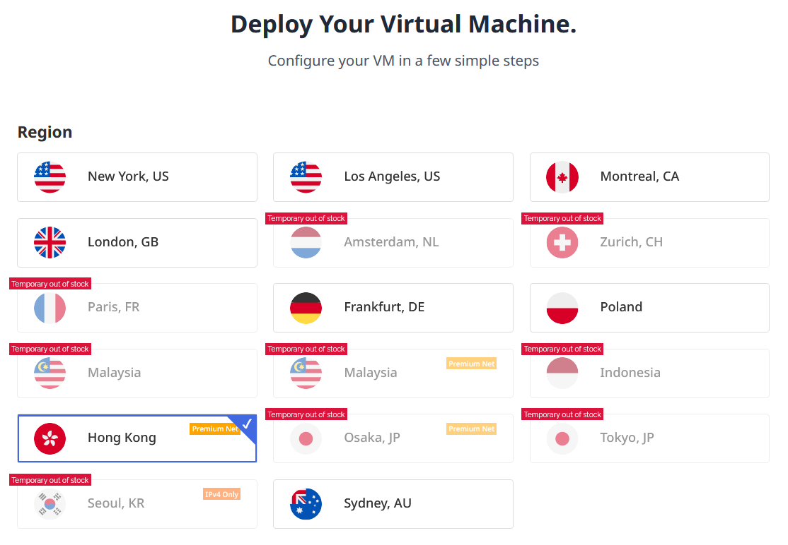
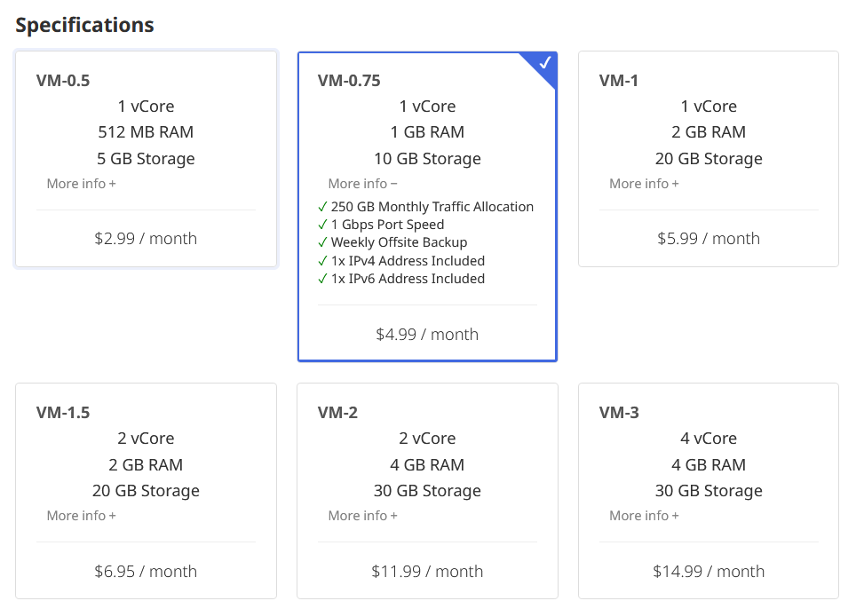
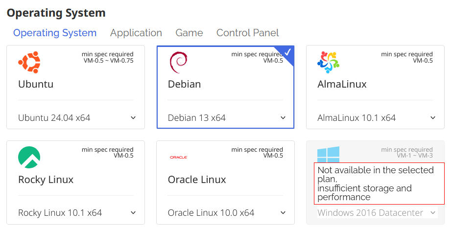
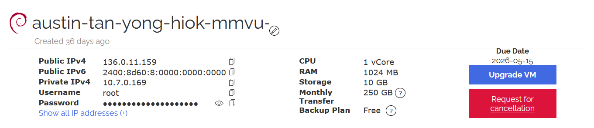

<!--more-->
## Introduction
The commercial VPNs we use is expensive and might not always be the best in terms of privacy and anonymity. Sometime even the speed is unstable. 

Of course, there are some VPNs that offer privacy at a reasonable price, but oftentimes they comes at a cost of poor accessibility in some areas with restricted internet access such as China or Iran.

In this guide, we will be using **VLESS + Reality + Vision** protocol for the proxy.

>[!info]- Why should we use this protocol? 
>Think of a normal VPN like a big armored truck driving down the road, everyone can see it's a security vehicle. In countries with high censorship, they just stop the truck. The method in this guide is like putting your data in a regular delivery van. To the outside world, it looks like you're just visiting a common site like Microsoft or Apple. It’s invisible because it blends in.

>[!info]- VPN? Proxy?
>Here are the comparison table of **VPN**, **proxy** and the **special type of proxy** we are going to use.
>|Features|VPN|Standard Proxy|VLESS+Reality+Vision|
>|:-:|:-:|:-:|:-:|
>|Encryption|Strong|None|Strongest (TLS 1.3)|
>|Detectability|High|Moderate|Low|
>|Speed|Medium|Fast|Fastest|
>|Setup|Easy|Medium|Hard|

Don't worry if the names sound technical, I will walk you through the setup step-by-step.

We will be using Evoxt as the VPS provider in this guide, you can choose provider of your own choices.

## Setting it up:
### Step 1: Renting a VPS
We need a server to host the service on, in this case a VPS(Virtual Private Server) will do. 

We will need to consider a few factors when choosing VPS. Most of the time, choosing the cheapest VPS package offered will do if this is the only service you want to run on it.

|Hardware|Minimum Requirement|
|--------|:-----------------:|
|CPU     | 1-Core            |
|RAM     | 1GB               |
|Network | IPv4              |
|Virtualization | KVM        |

Besides these hardware specification, you also need to consider where the VPS is located. 

Ideally, you would want the latency to be as low as possible for the best experience. You can check which location suits you best with the tools from the VPS provider, or by asking them directly.

>[!info]- Info - Latency
>💡Think of Latency like the time it takes for a ball to bounce back to you. The lower the number, the faster your internet will feel when clicking on links. *Latency is measured in 'ms'*.

Personally, I chose the Premium Connectivity Evoxt Japan VPS. Factoring in the location, this ended up being my choice. At a cost of $4.99USD, which can replace the two VPNs I was using which is a steal.

>[!Danger]+ Notice - Data Cap
>Look carefully at the **More Info** and find the **Monthly Traffic Allocation** this is essentially our monthly data cap on the server, once exceeded your proxy will no longer work until you top up for more allocation.

After choosing the specification of the VPS, we will choose the OS(Operating System) of our choice.

Here just choose the latest version of Debian.

Nicely done! We have finished configuring the VPS for purchase.

---

After payment, you will be able to find the **Public IP**, **Username** and **Password**.

### Step 2: Installing 3x-ui panel

### Step 3: Congfiguring inbound

### Step 4: Connecting to the proxy

<!--more-->
